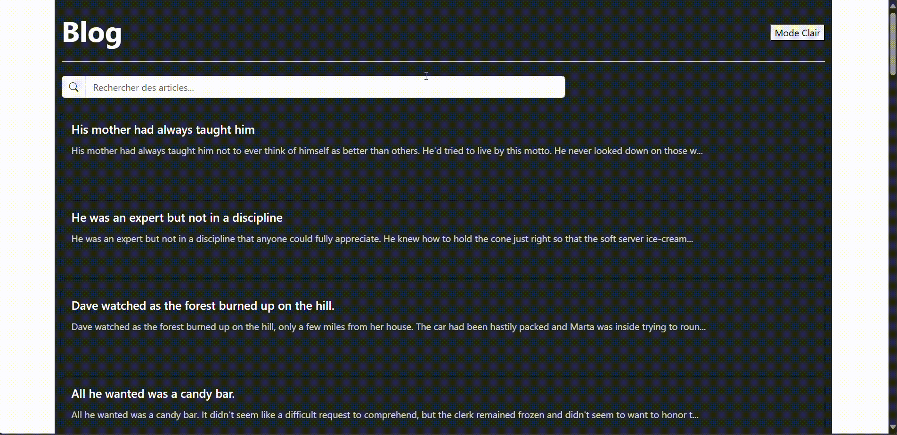

# TP React Hooks - Application de Blog

Ce TP a pour objectif de mettre en pratique l'utilisation des Hooks React (useState, useEffect, useCallback, useMemo) ainsi que la création de Hooks personnalisés à travers une application de blog simple.

## Installation et configuration initiale

1. Cloner le dépôt :

```bash
git clone https://github.com/pr-daaif/tp-react-hooks-blog.git
cd tp-react-hooks-blog
```

2. Créer votre propre dépôt sur Github et changer le remote :

```bash
# Supprimer le remote origine
git remote remove origin

# Ajouter votre nouveau remote
git remote add origin https://github.com/[votre-username]/tp-react-hooks-blog.git

# Premier push
git push -u origin main
```

3. Installer les dépendances :

```bash
npm install
```

4. Lancer l'application :

```bash
npm start
```

## Instructions pour le TP

Pour chaque exercice :

1. Lisez attentivement l'énoncé
2. Implémentez la solution
3. Testez votre implémentation (pensez à faire des copies d'écran)
4. Mettez à jour la section correspondante dans ce README avec :
   - Une brève explication de votre solution
   - Des captures d'écran montrant le fonctionnement
   - Les difficultés rencontrées et comment vous les avez résolues
5. Commitez vos changements avec un message descriptif

### Exercice 1 : État et Effets

#### Objectif : Implémenter l'affichage et la recherche de posts

- [ ] 1.1 Compléter le hook `usePosts` pour récupérer les posts depuis l'API dummyjson.com
- [ ] 1.2 Implémenter le composant `PostList` pour afficher les posts
- [ ] 1.3 Ajouter la fonctionnalité de recherche par titre ou contenu dans `PostSearch`
- [ ] 1.4 Documenter votre solution ici

_Votre réponse pour l'exercice 1 :_

```
usePosts Hook :

J'ai complété le hook usePosts pour récupérer les données de l'API https://dummyjson.com/posts/search.
L'URL de l'API est construite dynamiquement en utilisant le searchTerm passé en argument, permettant ainsi la fonctionnalité de recherche.
Les états posts, loading, et error sont gérés pour fournir un feedback à l'utilisateur sur l'état du chargement des données.
Un useEffect est utilisé pour déclencher la fonction fetchPosts chaque fois que le searchTerm change.
PostList Composant :

Le composant PostList reçoit les posts, loading, et error comme props.
Il affiche un LoadingSpinner pendant le chargement des données.
En cas d'erreur (error n'est pas null), un message d'erreur est affiché.
Si aucun post n'est trouvé après la recherche, un message "Pas de post disponible..." est affiché.
Chaque post est rendu à l'aide du composant PostDetails (qui sera complété dans l'exercice 4).
PostSearch Composant :

Le composant PostSearch gère l'input de recherche et appelle la fonction onSearch (passée via les props) à chaque modification de l'input.
Un état local searchInput est utilisé pour contrôler la valeur de l'input.
Un bouton pour effacer la recherche a été ajouté, ce qui réinitialise searchInput et appelle onSearch avec une chaîne vide.

```


### Exercice 2 : Hooks Personnalisés

#### Objectif : Créer des hooks réutilisables

- [ ] 2.1 Créer le hook `useDebounce` pour optimiser la recherche
- [ ] 2.2 Créer le hook `useLocalStorage` pour persister les préférences utilisateur
- [ ] 2.3 Utiliser ces hooks dans l'application
- [ ] 2.4 Documenter votre solution ici

_Votre réponse pour l'exercice 2 :_

```
Cet exercice se concentre sur la création de hooks personnalisés réutilisables.

useDebounce Hook :

Ce hook prend une valeur et un délai comme arguments.
Il utilise useState pour stocker la valeur "débouncée".
useEffect est utilisé pour mettre à jour la valeur "débouncée" après un délai spécifié. Si la valeur change pendant le délai, le timer est réinitialisé.
Ce hook retourne la valeur "débouncée".
useLocalStorage Hook :

Ce hook prend une clé et une valeur initiale comme arguments.
Il utilise useState pour stocker la valeur depuis le localStorage. Si la clé n'existe pas, il utilise la valeur initiale.
useEffect est utilisé pour mettre à jour le localStorage chaque fois que la valeur change.
Ce hook retourne la valeur et une fonction pour la mettre à jour.
```


### Exercice 3 : Optimisation et Context

#### Objectif : Gérer le thème global et optimiser les rendus

- [ ] 3.1 Créer le `ThemeContext` pour gérer le thème clair/sombre
- [ ] 3.2 Implémenter le composant `ThemeToggle`
- [ ] 3.3 Utiliser `useCallback` et `useMemo` pour optimiser les performances
- [ ] 3.4 Documenter votre solution ici

_Votre réponse pour l'exercice 3 :_

```
Cet exercice se concentre sur la gestion du thème global et l'optimisation des rendus.

ThemeContext :

J'ai créé un contexte ThemeContext pour gérer le thème clair/sombre de l'application.
Un ThemeProvider est utilisé pour fournir le contexte à toute l'application.
Le ThemeProvider utilise le hook useLocalStorage (de l'exercice 2) pour persister le thème choisi par l'utilisateur.
Un hook personnalisé useTheme est créé pour faciliter l'accès au contexte.
ThemeToggle :

Ce composant permet à l'utilisateur de basculer entre les thèmes clair et sombre.
Il utilise le hook useTheme pour accéder au thème actuel et à la fonction pour le changer.
useCallback et useMemo :

useCallback est utilisé pour mémoriser les fonctions de gestion d'événements, évitant ainsi de recréer ces fonctions à chaque rendu.
useMemo est utilisé pour mémoriser les valeurs calculées, évitant ainsi de recalculer ces valeurs à chaque rendu.
React.memo est utilisé pour optimiser les rendus des composants, en évitant de re-rendre les composants si leurs props n'ont pas changé.
```


### Exercice 4 : Fonctionnalités avancées

#### Objectif : Ajouter des fonctionnalités de chargement et détail

- [ ] 4.1 Implémenter le chargement infini des posts avec `useIntersectionObserver`
- [ ] 4.2 Créer le composant `PostDetails` pour afficher les détails d'un post
- [ ] 4.3 Ajouter la fonctionnalité de filtrage par tags
- [ ] 4.4 Documenter votre solution ici

_Votre réponse pour l'exercice 4 :_

```
Cet exercice se concentre sur l'ajout de fonctionnalités avancées : chargement infini, détails des posts, et filtrage par tags.

useIntersectionObserver Hook :

Ce hook détecte quand un élément devient visible dans le viewport.
Il utilise IntersectionObserver pour observer un élément cible.
Il retourne une référence à l'élément à observer et un état indiquant si l'élément est visible.
PostDetails Composant :

Ce composant affiche les détails complets d'un post, y compris le contenu, les réactions, l'utilisateur, et les tags.
Il permet de fermer les détails et de filtrer les posts par tag.
Chargement infini :

Le hook useIntersectionObserver est utilisé pour détecter quand l'utilisateur atteint la fin de la liste des posts.
Quand la fin de la liste est atteinte, une fonction est appelée pour charger plus de posts.
Filtrage par tags :

Un sélecteur de tags est ajouté au composant PostSearch.
Quand un tag est sélectionné, une fonction est appelée pour filtrer les posts par ce tag.
```


## Structure détaillée du projet

```
📁 ./
├─ 📄 README.md
├─ 📄 package.json
├─ 📁 public/
│  └─ 📄 index.html
└─ 📁 src/
   ├─ 📄 App.js               # Composant principal de l'application
   ├─ 📄 App.css              # Styles CSS de l'application
   ├─ 📁 components/
   │  ├─ 📄 PostList.js       # Liste des posts
   │  ├─ 📄 PostSearch.js     # Barre de recherche
   │  ├─ 📄 PostDetails.js    # Détails d'un post
   │  ├─ 📄 ThemeToggle.js    # Bouton pour changer de thème
   │  └─ 📄 LoadingSpinner.js # Indicateur de chargement
   ├─ 📁 hooks/
   │  ├─ 📄 usePosts.js       # Hook pour gérer les posts
   │  ├─ 📄 useDebounce.js    # Hook pour débouncer les valeurs
   │  ├─ 📄 useLocalStorage.js # Hook pour gérer le localStorage
   │  └─ 📄 useIntersectionObserver.js # Hook pour le chargement infini
   ├─ 📁 context/
   │  └─ 📄 ThemeContext.js   # Contexte pour le thème
   ├─ 📄 index.css
   └─ 📄 index.js
```

## Ressources utiles

- Documentation de l'API: [https://dummyjson.com/docs/posts](https://dummyjson.com/docs/posts)
- Documentation React Hooks: [https://fr.reactjs.org/docs/hooks-intro.html](https://fr.reactjs.org/docs/hooks-intro.html)
- Guide sur les hooks personnalisés: [https://fr.reactjs.org/docs/hooks-custom.html](https://fr.reactjs.org/docs/hooks-custom.html)

## Rendu

- Ajoutez l'URL de votre dépôt Github dans **Classroom** et envoyez la réponse dès le démarrage de votre projet.
- Les push doivent se faire au fur et à mesure que vous avancez dans votre projet.
- Le README.md doit être à jour avec vos réponses et captures d'écran.
- Chaque exercice doit faire l'objet d'au moins un commit avec un message mentionnant le numéro de l'exercice.

---

# Documentation de l'API dummyjson - Posts

Pour réaliser ce TP, vous utiliserez l'API dummyjson.com qui fournit des données fictives de posts de blog. Voici les points d'entrée que vous utiliserez :

## Points d'entrée API

### Récupérer tous les posts

```
GET https://dummyjson.com/posts
```

Paramètres de requête optionnels :

- `limit` : nombre de posts à récupérer (défaut: 30)
- `skip` : nombre de posts à sauter (pour la pagination)

Exemple : `https://dummyjson.com/posts?limit=10&skip=10`

### Récupérer un post spécifique

```
GET https://dummyjson.com/posts/{id}
```

Exemple : `https://dummyjson.com/posts/1`

### Rechercher des posts

```
GET https://dummyjson.com/posts/search?q={terme}
```

Exemple : `https://dummyjson.com/posts/search?q=love`

### Récupérer les posts par tag

```
GET https://dummyjson.com/posts/tag/{tag}
```

Exemple : `https://dummyjson.com/posts/tag/history`

## Format de réponse

### Liste de posts

```json
{
  "posts": [
    {
      "id": 1,
      "title": "His mother had always taught him",
      "body": "His mother had always taught him not to ever think of himself as better than others. He'd tried to live by this motto. He never looked down on those who were less fortunate or whose decisions had led them astray.",
      "userId": 9,
      "tags": ["history", "american", "crime"],
      "reactions": 2
    },
    ...
  ],
  "total": 150,
  "skip": 0,
  "limit": 30
}
```

### Post unique

```json
{
  "id": 1,
  "title": "His mother had always taught him",
  "body": "His mother had always taught him not to ever think of himself as better than others. He'd tried to live by this motto. He never looked down on those who were less fortunate or whose decisions had led them astray.",
  "userId": 9,
  "tags": ["history", "american", "crime"],
  "reactions": 2
}
```

## Conseils d'utilisation

- Pour la pagination, utilisez les paramètres `limit` et `skip`
- Pour calculer le nombre total de pages, utilisez la formule : `Math.ceil(total / limit)`
- Pour implémenter le défilement infini, chargez plus de posts quand l'utilisateur atteint le bas de la page
- Pour la recherche, utilisez le point d'entrée `/posts/search` avec le paramètre `q`
- Vous pouvez combiner les paramètres de recherche avec les paramètres de pagination
